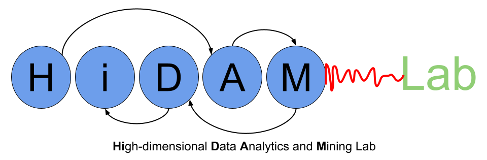
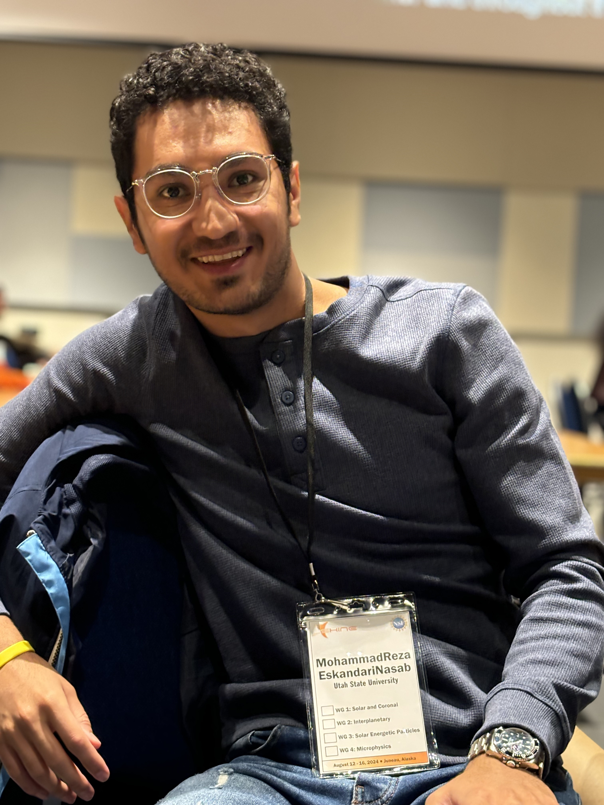
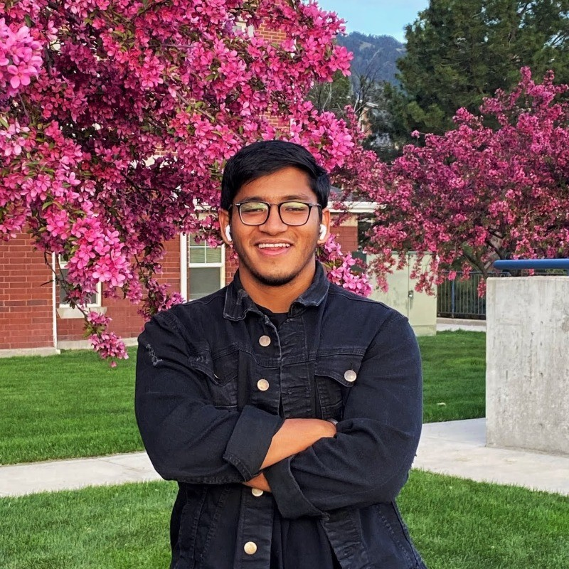

<!-- Top-centered logo (put logo.png next to this file) -->

  

## Prediction of Solar Eruptive Events



## Current Students

  

    
    

      <ul>
        <li><strong>Name:</strong> <a href="https://www.linkedin.com/in/samresume/" target="_blank" rel="noopener">MohammadReza EskandariNasab</a></li>
        <li><strong>Degree:</strong> PhD, CS</li>
        <li><strong>Project:</strong> Time series data augmentation and developing ML cyberinfrastructure</li>
        <li><strong>Achievements:</strong> Conference papers in ICDM, SDM, Big Data, and ICMLA; journal article in ApJS; two NSF travel awards; one SIAM travel award.</li>
      </ul>
    

  

  

    
    

      <ul>
        <li><strong>Name:</strong> <a href="https://www.linkedin.com/in/onur-vural-696706220/" target="_blank" rel="noopener">Onur Vural</a></li>
        <li><strong>Degree:</strong> PhD, CS</li>
        <li><strong>Project:</strong> Contrastive learning and embedding of functional networks</li>
        <li><strong>Achievements:</strong> Conference papers in Big Data and ICMLA; journal article in Remote Sensing.</li>
      </ul>
    

  

  

    
    

      <ul>
        <li><strong>Name:</strong> <a href="https://www.linkedin.com/in/s-c7/" target="_blank" rel="noopener">Santosh Chapagain</a></li>
        <li><strong>Degree:</strong> PhD, CS</li>
        <li><strong>Project:</strong> Large Language Models and text representation learning</li>
        <li><strong>Achievements:</strong> Conference papers in CIKM, Big Data, DSAA, and ICWSM; journal article in Social Network Analysis and Mining.</li>
      </ul>
    

  

  

    
    

      <ul>
        <li><strong>Name:</strong> <a href="https://www.linkedin.com/in/nwnelson/" target="_blank" rel="noopener">Nathan Nelson</a></li>
        <li><strong>Degree:</strong> MS, CS</li>
        <li><strong>Project:</strong> Causal inference on multivariate time series data of solar eruptive events</li>
      </ul>
    

  

## Past Students

  

    
    

      <ul>
        <li><strong>Name:</strong> <a href="https://www.linkedin.com/in/1420kartik/" target="_blank" rel="noopener">Kartik Saini</a></li>
        <li><strong>Degree:</strong> MS, CS, USU (2023)</li>
        <li><strong>Thesis:</strong> <a href="https://digitalcommons.usu.edu/etd2023/88/" target="_blank" rel="noopener">Solar Flare Prediction From Extremely Imbalanced Multivariate Time Series Data Using Minimally Random Convolutional Kernel Transform</a></li>
        <li><strong>Achievements:</strong> Conference papers in ICMLA; journal article in Universe.</li>
        <li><strong>Current Position:</strong> SDE 2, Amazon.</li>
      </ul>
    

  

  

    
    

      <ul>
        <li><strong>Name:</strong> Dr. Khaznah Alshammari</li>
        <li><strong>Degree:</strong> PhD, CS, NMSU (2024)</li>
        <li><strong>Thesis:</strong> Deep Learning Approaches for Multivariate Time Series: Advances in Feature Selection, Classification, and Forecasting</li>
        <li><strong>Achievements:</strong> Conference papers in ICPR, Big Data, and ICMLA; journal article in ApJS.</li>
        <li><strong>Current Position:</strong> Assistant Professor (tenure-track), Computer Science, Northern Border University, Saudi Arabia.</li>
      </ul>
    

  

  

    
    

      <ul>
        <li><strong>Name:</strong> Dr. Cory Cascalheira</li>
        <li><strong>Degree:</strong> PhD, Psychology, NMSU (2024)</li>
        <li><strong>Thesis:</strong> Computational Methods Investigating Psychosocial Stressors Among Sexual And Gender Minority People: A Machine Learning And Natural Language Processing Approach</li>
        <li><strong>Achievements:</strong> Conference papers in Big Data and ICWSM.</li>
        <li><strong>Current Position:</strong> Postdoctoral scholar, VA Puget Sound Health Care System, Seattle, WA, USA.</li>
      </ul>
    

  

  

    
    

      <ul>
        <li><strong>Name:</strong> Junyong Lee</li>
        <li><strong>Degree:</strong> MS, CS, NMSU (2021)</li>
        <li><strong>Thesis:</strong> Implementation Of Web-based Interface For Graph Embedding Methods And Machine Learning Pipeline</li>
        <li><strong>Current Position:</strong> Full stack developer, University of New Mexico.</li>
      </ul>
    

  

